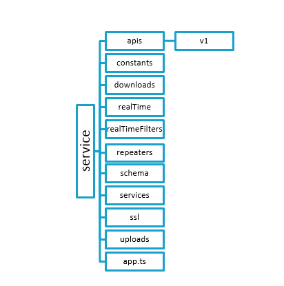

##	About ChatElite

ChatElite is a web application that provides peer-to-peer and group chat. ChatElite is developed using Node.js and Mongo DB for database. ChatElite can be used as pluggable chat tool by using collapsed mode. This mode can be used to integrate ChatElite with another web-based application.

**ChatElite** lets users send messages and files to one another. Besides, users can create groups and also add and remove users from their list. Some of the important features of ChatElite are as follows:

*	Transfer chat: Users can transfer the entire one-on-one or group chat/conversation to another person or via email.
*	Convert chat into group for peer-to-peer chats and for group chat
*	Add users to group: Once a group is formed, user can add new users to the group.
*	Remove users from group: From a group, user can remove certain users.
*	Leave group: If user is added to certain ChatElite group and doesn’t wish to be a part of it anymore, he can leave the group. 
*	Search for a keyword in chat: User can search for a keyword within a chat.
*	Download chat: User can download the chat and keep a copy on the PC.
*	Marking a message as favourite (or as un-favourite if marked as favourite previously)
*	Deleting messages
*	Replying to messages
*	Read receipts: Users can view who has read their messages.

**A user-friendly chat application:**

One of the most important features that ChatElite holds, is its easy use. Here are some more features that make the ChatElite app user-friendly:

*	Users can find the recent chats they were involved in, groups that they were part of and the users added to their list. 
*	Users can view particular chat on clicking on any of the groups or recent chats. 
*	For a peer-to-peer chat, a user can find the groups that one has in common with the particular user and the favourite messages in that chat. 
*	For a group, a user can see all the group members’ information and remove any member if the group has been created by the user himself. 
*	One can also view the shared links in the group chat and the favourite messages in that group chat. 


## Prerequisites

*	**Git**
    * **On Windows**:
	    * Download the latest [Git for Windows installer](https://gitforwindows.org/).
        * When you have successfully started the installer, you will see the Git Setup Wizard screen. Follow the Next and Finish prompts to complete the installation.
        * Open a Command Prompt (or Git Bash if during installation you elected not to use Git from the Windows Command Prompt).
        * Run the following commands to configure your Git username and email using the following commands. 

        ```
            $ git config --global user.name “user name”
            $ git config --global user.email “email id”
        ```

    * **On Linux/Mac**: To install on a Linux or a Mac, follow [these](https://git-scm.com/book/en/v2/Getting-Started-Installing-Git) instructions.

*	**Node**: Follow [these](https://nodejs.org/en/download/) instructions to download and install Node.js according to your operating system.

*	**Mongo**: Follow [these](https://docs.mongodb.com/manual/installation/#mongodb-community-edition) instructions to download and install Mongo DB according to your operating system and requirement.

*	**Visual Studio Code**: It is recommended. However, you can use any other editor. Follow [these](https://code.visualstudio.com/download) instructions to install Visual Studio Code.

## Getting Started

* Follow the instructions from [**ChatEliteUi repository**](https://github.com/XoriantOpenSource/ChatEliteUi#execution-on-localhost). 

##	System Design

###	Service repository structure



This repository contains the server-side code which includes business logic, database queries, Socket APIs, REST APIs, API call execution methods.
The documentation is available [here](https://xoriantopensource.github.io/ChatEliteService/).
 

*	The **APIs folder** consists of v1 folder which contains all the REST APIs.
    *	**discussionApi**: This includes all the APIs related to a conversation like file upload-download, download chat and get read messages.
    *	**userApi**: This includes all the APIs like authenticate, re-join and fetch user data.

*	The **App folder** contains the bundled UI files. These UI files are built by Webpack.

*	The **Constants** folder has enums which contain the constants used in the project.

*	The **Downloads** folder stores all the group wise csv files of the chats.

*	The **realTime folder** contains all the Socket APIs. 
    *	**Conversation**: It has all conversation related socket APIs like send message, last message in conversation and conversation history
    *	**History**: It has Socket APIs related to history of recent chats and groups like add user and transfer user. 
    *	**User**: It has Socket APIs related to user like join user, leave, disconnect socket and user status.
    *	**Ticker**: It has Socket APIs related to ticker like add user to ticker and display ticker users.

*	**realTimeFilters**: As the server is a stateless server, every time for every request, the user is needed to be authorized, also the version is needed to be checked before executing socket request. Whenever, user becomes active from inactive state, server informs.

*	**Repeaters**: It contains all the schedulers required. 
    *	**emailRepeaters**: It periodically checks user status and updates the offline user’s list.
    *	**unreadMessagesRepeaters**: This scheduler runs every 10 seconds to check for unread messages.
    *	**userCleanupRepeaters**: It checks for socket connection status and removes the socket that is disconnected.

*	The **Schema folder** consists of the database schemas. 
    *	**appConfig**: It has the provision to make features available grade wise.
    *	**Chat**: It has schema for a single chat group.
    *	**Device**: It has schema for devices and platforms that ChatElite is used from.
    *	**Documents**: It has schema of documents uploaded.
    *	**Users**: It has schema for user data.

*	The **Services folder** consist all the common functionalities used throughout the project.
    *	**apiService**: It has methods for accessing external REST APIs.
    *	**commonService**: It has all the common/reusable methods needed throughout the project.
    *	**getService**: It creates instances for various service classes. 
    *	**mailingService**: It has logic for sending emails to offline users.
    *	**notificationService**: It has logic for push notifications for ChatElite when users are away. 
    *	**socketService**: It contains logic for syncing multiple sockets of single users. This service has two methods:
*	**emitToSelf** sends data to all sockets that are active for a particular user. 
*	**groupBroadcast** sends data to group-members that are not joined to the group.

*	The **SSL folder** stores the key and certificate for secure http (https).

*	The **Uploads folder** store the uploaded files.

*	The **app.ts folder** consist of the configurations files for the project.

##	Contribution Guidelines

See the contributing guidelines [here](./CONTRIBUTING.md).

## Licensing

Licensed under the [MIT License](./LICENSE).

## Documentation

The documentation for the t-webapi framework methods is available [here](https://chatelite.xoriant.com:5465).

## Contributors

Thanks goes to these wonderful folks for contribution :

<!-- ALL-CONTRIBUTORS-LIST:START - Do not remove or modify this section -->
<!-- prettier-ignore -->
| [<br /><sub><b>Pranay Dutta</b></sub>](https://github.com/pranaydutta89)<br /> [💻](#code-pranaydutta "Code")  [🤔](#ideas-pranaydutta "Ideas, Planning, & Feedback") | [<br /><sub><b>Abhijeet sonaje</b></sub>](https://github.com/abhijeet2015)<br /> [💻](#code-abhijeetsonaje "Code")  [🤔](#ideas-abhijeetsonaje "Ideas, Planning, & Feedback") | [<br /><sub><b>Nayan Kamble</b></sub>](https://github.com/nayankamble)<br /> [💻](#code-nayankamble "Code") [📖](#docs-nayankamble "Documentation") | [<br /><sub><b>Ravichandra Bhanage</b></sub>](https://github.com/bhanage-ravic)<br /> [💻](#code-ravichandrabhanage "Code") | [<br /><sub><b>Shailesh Pardeshi</b></sub>](https://github.com/shailesh757)<br />[🤔](#ideas-shaileshpardeshi "Ideas, Planning, & Feedback") |
| :---: | :---: | :---: | :---: | :---: |
<!-- ALL-CONTRIBUTORS-LIST:END -->
